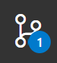

# 2D-game-engine
https://vscode.dev/github/Kentwood-Programming-Club/2D-game-engine

## Good Resources to learn Javascript
### W3 Schools
https://w3schools.com

### Mozilla Deveoloper Docs
https://developer.mozilla.org/en-US/docs/Web/JavaScript

## Git commands
On the sidebar you should see an icon 
 

This is where you can update changes via Git.

To sync all the file changes for everyone, you can use `commit and push`. To commit you must first `stage` all the changes (you can pick and choose, say youre not ready to commit some files)

To update your workspace wil changes others have made, use `pull`.

Its a good idea to have VSCode and git installed on your computer.
you can get Git from [here](https://github.com/git-for-windows/git/releases/download/v2.38.1.windows.1/Git-2.38.1-64-bit.exe)

You can get VSCode from [here](https://code.visualstudio.com/sha/download?build=stable&os=win32-x64-user)

You can install the Live Server extension from the extensions panel to view our game (or click this link)

vscode:extension/ritwickdey.LiveServer